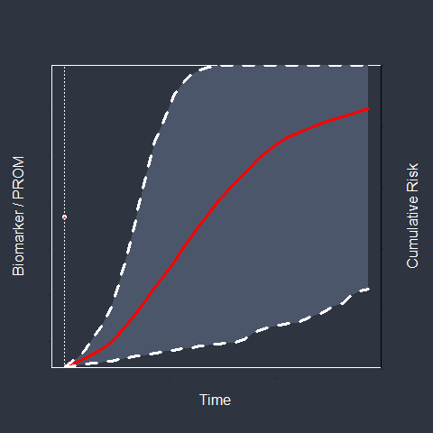

class: title-slide-custom
count: false

```{r setup, include=FALSE}
library("JMbayes2")
library("knitr")
library("animation")
library("ggplot2")

nord0 = "#2E3440"
nord1 = "#3B4252"
nord2 = "#434C5E"
nord3 = "#4C566A"

## Snow Storm colors
nord4 = "#D8DEE9"
nord5 = "#E5E9F0"
nord6 = "#ECEFF4"

## Frost colors
nord7 = "#8FBCBB"
nord8 = "#88C0D0"
nord9 = "#81A1C1"
nord10 = "#5E81AC"

## Aurora colors
nord11 = "#BF616A"
nord12 = "#D08770"
nord13 = "#EBCB8B"
nord14 = "#A3BE8C"
nord15 = "#B48EAD"

knitr::opts_chunk$set(dev = "png", dpi = 600, 
                      dev.args = list(bg = "transparent", type = "cairo",
                                      antialias = "none"),
                      out.width = "100%", fig.width = 8, fig.height = 3.5)

xaringanExtra::use_tile_view()
xaringanExtra::use_fit_screen()
load("plotJM_data.RData")
```

<!-- <h1>JMbayes2</h1> -->
<div style="font-size: 50pt; font-weight: 900; color: var(--nord4); margin-top: 60px;">
Joint Models
</div>

<div style="font-size: 26pt; color: var(--nord9); font-weight: 300; margin-top:40px;">
A Brief Introduction
</div>

<div id = "author">
<div style = "font-size: 30pt; font-weight: bolder; color: var(--nord4);">Dimitris Rizopoulos</div>
<div style = "color: var(--nord9);">Department of Biostatistics</div>
</div>

<div id="contact">
<a href="mailto:d.rizopoulos@erasmusmc.nl"><i class="fas fa-envelope"></i> d.rizopoulos@erasmusmc.nl</a> &emsp;
<a href="https://x.com/drizopoulos"><i class="fab fa-twitter"></i> drizopoulos</a> &emsp;
<a href="https://github.com/drizopoulos"><i class="fab fa-github"></i> drizopoulos</a> &emsp;
</div>

---
layout: true

<link href="https://unpkg.com/nord-highlightjs@0.1.0/dist/nord.css" rel="stylesheet" type="text/css" />
<link href="fontawesome-free-5.14.0-web/css/all.css" rel="stylesheet">

<div class="my-footer"><span>
<a href="https://x.com/drizopoulos"><i class="fab fa-twitter"></i> drizopoulos</a>
&emsp;&emsp;&emsp;&emsp;
<a href="https://github.com/drizopoulos"><i class="fab fa-github"></i> drizopoulos</a> &emsp;&emsp;&emsp;&emsp;
<a href = "https://www.drizopoulos.com/"><i class="fas fa-globe-americas"></i> www.drizopoulos.com</a>
</span></div> 


---

## What is a Joint Model

```{r, echo = FALSE, results = 'hide', message=FALSE}
saveGIF({
    for(i in 1:10) {
        op <- par(mgp = c(2, 0.0, 0), tcl = 0, bg = nord0, col.lab = "white", col = "white")
        JM::plot.survfitJM(survPrbs[[i]], estimator = "mean", conf.int = TRUE,
                           include.y = TRUE, lwd = 3, ylab = "Cumulative Risk", 
                           ylab2 = "Biomarker / PROM", xlab = "Time", fun = function (x) 1 - x,
                           main = "", col.points = "white", col.abline = "white", col.area = nord3,
                           cex.axis = 0.001, cex.axis.z = 0.001, cex.lab = 1.3, cex.lab.z = 1.3,
                           col = c("red", "white", "white"), fill.area = TRUE, pch = 16, lty = c(1, 2, 2))
        par(op)
    }
}, movie.name = "./JM.gif")
```



---

## A Bit of History

<p> </p>

<div style = "width: 75%; padding: 1.15em 2em; background-color: var(--nord0); margin: auto; display: block;">
<strong>Joint models have been around for many years...</strong>
</div>

--

<br>

*<font color = "#EBCB8B">Two parallel trajectories</font>*

.pull-left[
**Longitudinal Outcomes**
<div style = "width: 75%; padding: 1.15em 2em; background-color: var(--nord0); margin: auto; display: block;">
non-random dropout
</div>
]

.pull-right[
**Event Process**
<div style = "width: 75%; padding: 1.15em 2em; background-color: var(--nord0); margin: auto; display: block;">
endogenous time-varying covariates
</div>
]

---

## Missing Data Perspective

<div style = "width: 75%; padding: 1.15em 2em; background-color: var(--nord0); margin: auto; display: block;">
<strong>Participants do not adhere to measurement schedules or completely dropout from the study</strong>
</div>

--

<br>

<font color = "#EBCB8B">Implications</font>

- less data than originally planned $\Rightarrow$ <font color = "#B48EAD">efficiency loss</font>
- unequal number of measurements $\Rightarrow$ <font color = "#B48EAD">restrictions in analysis methods</font>
- missingness depends on outcome $\Rightarrow$ <strong><font color = "#BF616A">Potential Bias</font></strong>

---

## Missing Data Mechanisms

<div style = "width: 75%; padding: 1.15em 2em; background-color: var(--nord0); margin: auto; display: block;">
<strong>Missing Completely At Random</strong>: no relation to outcome
</div>

--

<br>

<div style = "width: 75%; padding: 1.15em 2em; background-color: var(--nord0); margin: auto; display: block;">
<strong>Missing At Random</strong>: related to <font color = "#D08770">observed</font> responses
</div>

--

<br>

<div style = "width: 75%; padding: 1.15em 2em; background-color: var(--nord0); margin: auto; display: block;">
<strong>Missing Not At Random</strong>: related to <font color = "#BF616A">unobserved</font> responses
</div>

---

## Analysis with Incomplete Data

<div style = "width: 75%; padding: 1.15em 2em; background-color: var(--nord0); margin: auto; display: block;">
<strong>Statistical analysis should be at least valid under MAR</strong>
</div>

--

<br>

.pull-left[
<strong><font color = "#D08770">Valid under MAR</font></strong>
- marginal likelihood-based models
- random effects models
- multiple imputation
]

.pull-right[
<strong><font color = "#BF616A">Biased under MAR</font></strong>
- generalized estimating equations
- misspecified likelihood-based methods
- single imputation
]

---

## Analysis with Incomplete Data

<div style = "width: 55%; padding: 1.15em 2em; background-color: var(--nord0); margin: auto; display: block;">
<strong>For MNAR we need specialized models</strong>
</div>

<br>

.pull-left[
**Conditional Models**
<button class="modal-button" href="#SMs"><strong>Selection Models</strong></button>
<div id="SMs" class="modal">
  <div class="modal-content">
  <span class="close">&times;</span>
  <ul>
    <li> sudden change in outcome causes dropout</li>
    <li> discrete time</li>
    <li> <font color = "#BF616A">limited software availability</font></li>
  </ul>
  </div>
</div>

<button class="modal-button" href="#PMs"><strong>Pattern Mixture Models</strong></button>
<div id="PMs" class="modal">
  <div class="modal-content">
  <span class="close">&times;</span>
  <ul>
    <li> analysis per dropout pattern</li>
    <li> clear assumptions how to identify the distribution of incomplete data</li>
    <li> discrete time</li>
    <li> <font color = "#BF616A">limited software availability</font></li>
  </ul>
  </div>
</div>

]

.pull-right[
**Shared Parameter Models**
<button class="modal-button" href="#JMs"><strong>Joint Models</strong></button>
<div id="JMs" class="modal">
  <div class="modal-content">
  <span class="close">&times;</span>
  <ul>
    <li> characteristics of the longitudinal profiles dictate dropout</li>
    <li> can handle intermittent missing data</li>
    <li> <font color = "#A3BE8C">available software</font></li>
  </ul>
  </div>
</div>
]

---

## Joint Models for MNAR

<div style = "width: 70%; padding: 1.15em 2em; background-color: var(--nord0); margin: auto; display: block;">
<strong>Basic assumption: <font color = "#BF616A">Conditional Independence</font></strong> <br> The random effects \(\color{var(--nord11)}{\mathbf b}\) explain all interrelationships.
</div>

.footnote[
[<i class = "fas fa-book"></i> Rizopoulos (2012)](https://www.crcpress.com/product/isbn/9781439872864)
]

--

<br>
* $\mathcal{Y}$: Longitudinal outcome
* $\mathcal{T}$: Time-to-Dropout process

--

\begin{align*}
p\{\mathcal{Y},\, \mathcal{T} \mid \color{var(--nord11)}{\mathbf b}\} = 
p\{\mathcal{Y} \mid \color{var(--nord11)}{\mathbf b}\} \; 
p\{\mathcal{T} \mid \color{var(--nord11)}{\mathbf b}\}
\end{align*}

---

## Joint Models for MNAR


---

## Joint Models for MNAR

*<font color = "#EBCB8B">More formally</font>*

<br>

\begin{eqnarray*}
y(t) & = & \color{var(--nord14)}{\eta(t, \color{var(--nord11)}{b})} = \bbox[#2E3440, 5pt]{\mathbf x(t)^\top \boldsymbol \beta} + \mathbf z(t)^\top \color{var(--nord11)}{\mathbf b} + \varepsilon(t), \quad \varepsilon(t) \sim \mathcal{N}(0, \sigma^2)\\&&\\
h(t) & = & h_0(t) \exp\biggl\{\mathbf w^\top \boldsymbol \gamma + \alpha f\{\color{var(--nord14)}{\eta(t, \color{var(--nord11)}{\mathbf b})}\}\biggr\}\\&&\\
\color{var(--nord11)}{\mathbf b} & \sim & \mathcal{N}(\mathbf 0, \mathbf D)
\end{eqnarray*}

---

## Event Outcome Perspective

<div style = "width: 75%; padding: 1.15em 2em; background-color: var(--nord0); margin: auto; display: block;">
<strong><font color = "#D08770">Aim:</font> study the link between <font color = "#A3BE8C">longitudinal biomarker/PROM</font> measurements and an <font color = "#BF616A">endpoint</font></strong>
</div>

--

<br>

<font color = "#EBCB8B">Examples</font>

- <font color = "#A3BE8C">serial heart rate variability</font> linked to <font color = "#BF616A">coronary heart disease</font>
- <font color = "#A3BE8C">serial cortisol levels</font> linked to <font color = "#BF616A">cardiometabolic syndrome</font>
- <font color = "#A3BE8C">serial stress levels</font> linked to <font color = "#BF616A">depression episodes</font>

---

## Endogenous Covariates

<div style = "width: 75%; padding: 1.15em 2em; background-color: var(--nord0); margin: auto; display: block;">
<strong>The longitudinal outcomes are <font color = "#B48EAD">time-varying covariates</font> for the time-to-event process</strong>
</div>

--

<br>

<strong><font color = "#EBCB8B">Problem</font></strong>

.pull-left[
<button class="modal-button" href="#Endng"><strong>Endogenous Covariates</strong></button>
<div id="Endng" class="modal">
  <div class="modal-content">
  <span class="close">&times;</span>
  <ul>
    <li> outcomes generated by the individuals</li>
    <li> <font color = "#BF616A">their value directly informs the existence of the endpoint</font></li>
  </ul>
  </div>
</div>
]

.pull-right[
<button class="modal-button" href="#Cox"><strong>Standard Survival Models</strong></button>
<div id="Cox" class="modal">
  <div class="modal-content">
  <span class="close">&times;</span>
  <ul>
    <li> Cox model and its extension only valid for exogenous covariates</li>
    <li> <font color = "#BF616A">they give biased results for endogenous ones</font></li>
  </ul>
  </div>
</div>
]

---

## JMs for Endogenous Covariates

<br>

<div style = "width: 75%; padding: 1.15em 2em; background-color: var(--nord0); margin: auto; display: block;">
<strong><font color = "#D08770">Joint Models</font> have been developed to accommodate endogenous time-varying covariates</strong>
</div>

--

<br>

- we use a model to describe the subject-specific longitudinal trajectories
- link these trajectories to the risk of the event

---

## JMs for Endogenous Covariates


---
## JMs for Endogenous Covariates

*<font color = "#EBCB8B">More formally</font>*

<br>

\begin{eqnarray*}
y(t) & = & \color{var(--nord14)}{\eta(t, \color{var(--nord11)}{b})} = \mathbf x(t)^\top \boldsymbol \beta + \mathbf z(t)^\top \color{var(--nord11)}{\mathbf b} + \varepsilon(t), \quad \varepsilon(t) \sim \mathcal{N}(0, \sigma^2)\\&&\\
h(t) & = & h_0(t) \exp\biggl\{\mathbf w^\top \boldsymbol \gamma + \bbox[#2E3440, 5pt]{\alpha f\{\color{var(--nord14)}{\eta(t, \color{var(--nord11)}{\mathbf b})}\}}\biggr\}\\&&\\
\color{var(--nord11)}{\mathbf b} & \sim & \mathcal{N}(0, D)
\end{eqnarray*}

---

## JMs Extensions

<br>

.pull-left[
**Longitudinal Process**
- multiple outcomes
- continuous, discrete, left-censored
- flexible models (splines, etc.)
]

.pull-right[
**Event Process**
- competing risks
- multi-state processes
- recurrent events
- multivariate
]

---

## JMs Extensions

**Conditional Independence:** .reference[[<i class = "fas fa-book"></i> Rizopoulos (2012)](https://www.crcpress.com/product/isbn/9781439872864)]

<ul class="fa-ul">
  <li><span class="fa-li" style = "color:var(--nord14);">
      <i class="far fa-smile"></i></span>
      mathematically convenient</li>
  <li><span class="fa-li" style = "color:var(--nord11);">
  <i class="far fa-frown"></i></span>
  computionally intensive</li>
</ul>

--

.pull-left[
**Maximum Likelihood:**
<div style = "width: 75%; padding: 1.15em 2em; background-color: var(--nord0); margin: auto; display: block;">
requires high-dimensional numerical integration
</div>
]

.pull-right[
**Bayesian:**
<div style = "width: 75%; padding: 1.15em 2em; background-color: var(--nord0); margin: auto; display: block;">
requires sampling high-dimensional random effects
</div>
]


---
class: center, middle, animated, fadeIn

# From Theory to Practice <br>JMbayes2

---

## A New R Package

.nord0box[
**<span style="font-size: 1.5rem;">&#8680;</span> 
Learning from the lessons of the past we decided to create a new package**
]

--

<br>

<font color = "#EBCB8B">Our aims</font>
<br>

.pull-left[
* versatile
* user-friendly
* fast
* complete
]

.pull-right[
<div style = "color: var(--nord3);">
<ul>
<li>cover (almost) all extensions</li>
<li>straightforward syntax</li>
<li><strong>C++</strong> implementation </li>
<li>support functions</li>
</ul>
</div>
]

---

## An Example

<br>

```{r, message = FALSE, cache = TRUE}
library("JMbayes2")
fm1 <- lme(CD4 ~ ns(obstime, 3), data = aids, 
           random = list(patient = pdDiag(~ ns(obstime, 3))))
CoxFit <- coxph(Surv(Time, death) ~ 1, data = aids.id)

jointFit1 <- jm(CoxFit, fm1, time_var = "obstime", n_iter = 5000L)
```

---

## Model Summary

.scroll450[
```{r}
summary(jointFit1)
```
]

---

## MAR vs MNAR

```{r, message = FALSE, include = TRUE, echo = FALSE}
object <- fm1
orig_data <- aids
newdata <- data.frame(obstime = seq(0, 18, len = 15))
form <- formula(object)
namesVars <- all.vars(form)
betas <- if (!inherits(object, "lme")) coef(object) else fixef(object)
V <- if (inherits(object, "geeglm")) object$geese$vbeta else vcov(object)
orig_data <- orig_data[complete.cases(orig_data[namesVars]), ]
Terms <- delete.response(terms(form))
mfX <- model.frame(Terms, data = orig_data)
Terms_new <- attr(mfX, "terms")
mfX_new <- model.frame(Terms_new, newdata, xlev = .getXlevels(Terms, mfX))
X <- model.matrix(Terms_new, mfX_new)
pred <- c(X %*% betas)
ses <- sqrt(diag(X %*% V %*% t(X)))
newdata$pred <- pred
newdata$low <- pred - 1.96 * ses
newdata$upp <- pred + 1.96 * ses

newdata$pred2 <- c(X %*% jointFit1$statistics$Mean$betas1)
newdata$low2 <- c(X %*% jointFit1$statistics$CI_low$betas1)
newdata$upp2 <- c(X %*% jointFit1$statistics$CI_upp$betas1)

t_col <- function(color, percent = 55, name = NULL) {
  rgb.val <- col2rgb(color)
  t.col <- rgb(rgb.val[1], rgb.val[2], rgb.val[3],
               max = 255,
               alpha = (100 - percent) * 255 / 100,
               names = name)
  t.col
}

op <- par(mgp = c(1.5, 0.5, 0), bg = nord0, col.lab = "white", col = "white", 
          col.axis = "white", tcl = -0.2, mar = c(4, 2.5, 0.5, 0.5))
plot(c(0, 18), range(cbind(newdata$pred, newdata$low, newdata$upp,
                           newdata$pred2, newdata$low2, newdata$upp2)),
     xlab = "Follow-up time (months)", ylab = expression(sqrt("CD4 cell count")),
     type = "n", xaxt = "n", yaxt = "n", cex.lab = 0.8)
axis(1, col.ticks = "white", col = "white", cex.axis = 0.7)
axis(2, col.ticks = "white", col = "white", cex.axis = 0.7)
polygon(c(newdata$obstime, rev(newdata$obstime)), c(newdata$upp2, rev(newdata$low2)),
        col = t_col("#5E81AC"), border = NA)
polygon(c(newdata$obstime, rev(newdata$obstime)), c(newdata$upp, rev(newdata$low)),
        col = t_col("#BF616A"), border = NA)
matlines(newdata$obstime, cbind(newdata$pred, newdata$pred2), 
         lty = 1, col = c("red", "blue"), lwd = 2)
legend("topright", c("Mixed Model - MAR", "Joint Model - MNAR"), lty = 1, 
       col = c("red", "blue"), lwd = 2, bty = "n", cex = 0.9)
par(op)
```

---

## Exogenous vs Endogenous

```{r, message = FALSE, echo = FALSE}
tvCox <- coxph(Surv(start, stop, event) ~ CD4, data = aids)
ss <- summary(tvCox)

res_tvCox <- ss$conf.int[, -1]
res_tvCox[2:3] <- 1 / res_tvCox[2:3]; res_tvCox[2] <- 1.256; res_tvCox[1] <- 1.20
res_JM <- exp(-summary(jointFit1)$Survival[c(1, 3, 4)]); res_JM[3] <- 1.235; res_JM[1] <- 1.325

op <- par(mgp = c(1.5, 0.5, 0), bg = nord0, col.lab = "white", col = "white", 
          col.axis = "white", tcl = -0.2, mar = c(4, 2.5, 0.5, 0.5))
matplot(cbind(rep(1, 3), rep(2, 3)), cbind(res_tvCox, c(res_JM)), type = "l",
        xlim = c(0.5, 3), lwd = 3, lty = 1, col = c("#BF616A", "#5E81AC"), 
        ylab = "Hazard Ratio", xlab = "", xaxt = "n", yaxt = "n")
abline(h = seq(1.15, 1.4, 0.05), col = "white", lty = 3, lwd = 0.9)
points(1:2, c(res_tvCox[1], res_JM[1]), pch = 16, cex = 1.3, 
       col = c("red", "blue"))
axis(1, at = 1:2, labels = c("Cox Model", "Joint Model"), col.ticks = "white", 
     col = "white", cex.axis = 0.8)
axis(2, col.ticks = "white", col = "white", cex.axis = 0.7)
par(op)
```

---

## More Features

.three-cols[

<button class="modal-button" href="#GLMMs"><strong>Mixed Effects Models</strong></button>
<div id="GLMMs" class="modal">
  <div class="modal-content">
  <span class="close">&times;</span>
  <ul>
  <li>Gaussian (<code>lme(...)</code>)</li>
    <li>Student's-t (<code>mixed_model(..., <span class="hljs-string">family = students.t(df = 4)</span>)</code>)</li>
    <li>Beta (<code>mixed_model(..., <span class="hljs-string">family = beta.fam()</span>)</code>)</li>
    <li>Gamma (<code>mixed_model(..., <span class="hljs-string">family = Gamma()</span>)</code>)</li>
    <li>censored Gaussian (<code>mixed_model(..., <span class="hljs-string">family = censored.normal()</span>)</code>)</li>
  </ul>
  <br>
  <ul>
    <li>Binomial (<code>mixed_model(..., <span class="hljs-string">family = binomial()</span>)</code>)</li>
    <li>Poisson (<code>mixed_model(..., <span class="hljs-string">family = poisson()</span>)</code>)</li>
    <li>Negative Binomial (<code>mixed_model(..., <span class="hljs-string">family = negative.binomial()</span>)</code>)</li>
    <li>Beta Binomial (<code>mixed_model(..., <span class="hljs-string">family = beta.binomial()</span>)</code>)</li>
  </ul>
  
  <a href="https://drizopoulos.github.io/JMbayes2/articles/Non_Gaussian_Mixed_Models.html"><i class="fas fa-globe-americas"></i> vignette distributions</a>
  </div>
</div>

<button class="modal-button" href="#MCEvents"><strong>Multi-State Processes</strong></button>
<div id="MCEvents" class="modal">
  <div class="modal-content">
  <span class="close">&times;</span>
  <strong>Using <code>mc_setup()</code> to setup the data and fitting a stratified Cox model</strong>
  <ul>
    <li>multiple longitudinal outcomes</li>
    <li>relative risk model per transition</li>
  </ul>
  
  <a href="https://drizopoulos.github.io/JMbayes2/articles/Multi_State_Processes.html"><i class="fas fa-globe-americas"></i> vignette multi-state</a>
  </div>
</div>


<button class="modal-button" href="#RecEvents"><strong>Recurrent Events</strong></button>
<div id="RecEvents" class="modal">
  <div class="modal-content">
  <span class="close">&times;</span>
  Using <code>rc_setup()</code> to setup the data, fitting a stratified Cox model 
  and calling <code>jm(..., <span class="hljs-string">recurrent = "..."</span>)</code>
  <ul>
    <li>multiple longitudinal outcomes</li>
    <li>relative risk model with a frailty term for recurrent events</li>
    <li>relative risk models competing risks terminating events linked with frailty</li>
    <li>gap time and calendar time formulations</li>
  </ul>
  
  <a href="https://drizopoulos.github.io/JMbayes2/articles/Recurring_Events.html"><i class="fas fa-globe-americas"></i> vignette recurrent</a>
  </div>
</div>

]

.three-cols[

<button class="modal-button" href="#FForms"><strong>Functional Forms</strong></button>
<div id="FForms" class="modal">
  <div class="modal-content">
  <span class="close">&times;</span>
  Via the <code>functional_forms</code> argument of <code>jm()</code> we can link different features of the longitudinal profiles to the risk of the event
  <ul>
    <li>value</li>
    <li>velocity</li>
    <li>acceleration</li>
    <li>average in a previous period</li>
  </ul>
  
  <a href="https://drizopoulos.github.io/JMbayes2/articles/JMbayes2.html#functional-forms"><i class="fas fa-globe-americas"></i> vignette functional forms</a>
  </div>
</div>

<button class="modal-button" href="#DynPred"><strong>Dynamic Predictions</strong></button>
<div id="DynPred" class="modal">
  <div class="modal-content">
  <span class="close">&times;</span>
  Using the <code>predict()</code> method we can calculate (dynamic) predictions
  <ul>
    <li>longitudinal outcomes</li>
    <li>event outcomes (including competing risks)</li>
    <li>accuracy measures</li>
      <ul>
        <li>discrimination: <code>tvROC()</code>, <code>tvAUC()</code></li>
        <li>calibration: <code>calibration_plot()</code>, <code>calibration_metrics()</code></li>
        <li>overall: <code>tvBrier()</code>, <code>tvEPCE()</code></li>
      </ul>
  </ul>
  
  <a href="https://drizopoulos.github.io/JMbayes2/articles/Dynamic_Predictions.html"><i class="fas fa-globe-americas"></i> vignette predictions</a>
  </div>
</div>

]

.three-cols[

<button class="modal-button" href="#Compare"><strong>Model Comparison</strong></button>
<div id="Compare" class="modal">
  <div class="modal-content">
  <span class="close">&times;</span>
      Using the <code>compare_jm()</code> function we can compare fitted joint models using DIC, WAIC and LPML
  <pre><code class="r hljs remark-code">
  <div class="remark-code-line"><span class="hljs-number">fit1</span> <- jm(<span class="hljs-number">CoxModel1</span>, <span class="hljs-number">MixedModels1</span>, ...)</div>
  <div class="remark-code-line"><span class="hljs-string">fit2</span> <- jm(<span class="hljs-string">CoxModel2</span>, <span class="hljs-string">MixedModels2</span>, ...)</div>
  <div class="remark-code-line"></div>
  <div class="remark-code-line">compare_jm(<span class="hljs-number">fit1</span>, <span class="hljs-string">fit2</span>)</div>
</code></pre>
  </div>
</div>

<button class="modal-button" href="#Penalties"><strong>Shrinkage Priors</strong></button>
<div id="Penalties" class="modal">
  <div class="modal-content">
  <span class="close">&times;</span>
      Using the <strong>priors</strong> argument we can specify penalties:
  <pre><code class="r hljs remark-code">
  <div class="remark-code-line">jm(..., <span class="hljs-number">priors = list("penalty_alphas" = "horseshoe")</span>)</div>
  <div class="remark-code-line"></div>
  <div class="remark-code-line">jm(..., <span class="hljs-number">priors = list("penalty_gammas" = "ridge")</span>)</div>
</code></pre>
  </div>
</div>

]

---
class: center, middle

.nord0box[
More about **JMbayes2** on the dedicated website<br><br>
<a href="https://drizopoulos.github.io/JMbayes2/"><i class="fas fa-globe-americas"></i> https://drizopoulos.github.io/JMbayes2/</a>
]

---
class: the-end, center, middle
layout: true
count: false

## Thank you for your attention!


<div id="contact">
<a href="mailto:d.rizopoulos@erasmusmc.nl"><i class="fas fa-envelope"></i> d.rizopoulos@erasmusmc.nl</a> &emsp;
<a href="https://x.com/drizopoulos"><i class="fab fa-twitter"></i> drizopoulos</a> &emsp;
<a href="https://github.com/drizopoulos"><i class="fab fa-github"></i> drizopoulos</a> &emsp;
<a href="https://www.drizopoulos.com/"><i class="fas fa-globe-americas"></i> https://www.drizopoulos.com/</a>
</div>

---
count: false

<!-- <script src='https://cdn.mathjax.org/mathjax/latest/MathJax.js?config=TeX-AMS-MML_HTMLorMML'></script> -->
<script type="text/javascript" async
  src="https://cdnjs.cloudflare.com/ajax/libs/mathjax/2.7.7/MathJax.js?config=TeX-MML-AM_CHTML">
</script>
 
 
<script>
// Get the button that opens the modal
var btn = document.querySelectorAll("button.modal-button");

// All page modals
var modals = document.querySelectorAll('.modal');

// Get the <span> element that closes the modal
var spans = document.getElementsByClassName("close");

// When the user clicks the button, open the modal
for (var i = 0; i < btn.length; i++) {
 btn[i].onclick = function(e) {
    e.preventDefault();
    modal = document.querySelector(e.target.getAttribute("href"));
    modal.style.display = "block";
 }
}

// When the user clicks on <span> (x), close the modal
for (var i = 0; i < spans.length; i++) {
 spans[i].onclick = function() {
    for (var index in modals) {
      if (typeof modals[index].style !== 'undefined') modals[index].style.display = "none";    
    }
 }
}

// When the user clicks anywhere outside of the modal, close it
window.onclick = function(event) {
    if (event.target.classList.contains('modal')) {
     for (var index in modals) {
      if (typeof modals[index].style !== 'undefined') modals[index].style.display = "none";    
     }
    }
}
</script>

